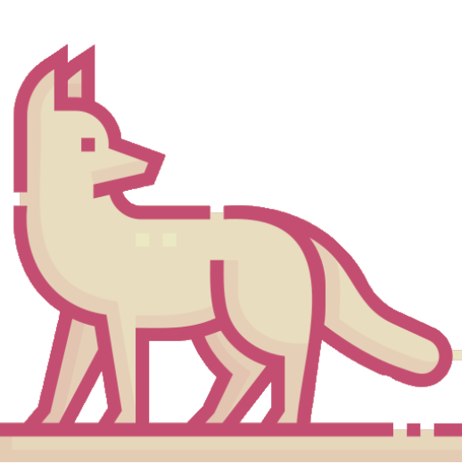

# Dylan Packham's Developer Portfolio Page 

Welcome to my portfolio website! This site showcases my journey as a fullstack developer, community builder, and explorer. Here, you'll find projects I've worked on, things I care about, and a few of my personal adventures. The site is built with Vue.js and Tailwind CSS to deliver a sleek, responsive, and visually engaging experience.

## 🛠️ Technologies Used

- **Vue.js**: JavaScript framework for a dynamic and responsive UI.
- **Tailwind CSS**: A utility-first CSS framework for fast and easy styling.
- **JavaScript**: Core scripting to enable interactive components.
- **Vite**: build tool for development.
- **HTML5 & CSS3**: For building the website structure and custom styling.
- **GitHub Pages**: Hosting platform used to deploy the portfolio.

## 🌟 Features

- **Responsive Design**: Fully responsive layout ensuring an optimized experience across devices (mobile, tablet, and desktop).
- **Interactive Project Showcase**: Hover effects and animations on project cards with frosted glass overlays for a modern UI feel.
- **Customizable Sections**: The page is divided into sections like "Projects," "Extras," and "Adventure" to present my work in an organized way.
- **Navigation & Smooth Scrolling**: Includes navigation links to scroll to various sections seamlessly.

## 💼 Sections

### 1. **Introduction**
A quick overview of who I am and what I'm passionate about. This section highlights my skills as a fullstack developer and the things I love working on.

### 2. **Projects**
A detailed list of some of the projects I’ve worked on, including links to GitHub repositories for code exploration.

### 3. **Extras**
This section contains personal projects, fun experiments, and tools I've built to solve real-world problems.

### 4. **Adventure**
Outside of coding, this section showcases my explorations, hobbies, and how I stay curious.

## 📸 Visual Highlights

Each section features interactive visuals. For example:
- **Frosted Glass Effect on Images**: Each project displays a card with a frosted glass hover effect, creating a dynamic and engaging UI.
- **Smooth Hover Animations**: Project images scale and elevate on hover, providing an immersive experience for users.

## 🎨 How to Run Locally

To run the portfolio locally on your machine:

1. **Clone the Repository**:
   ```bash
   git clone https://github.com/dpack1/portfolio
   cd portfolio
   
2. *Iinstall packages**
   ```bash
   npm install
   
3. **Run it!**
   ```bash
   npm run dev

## 
